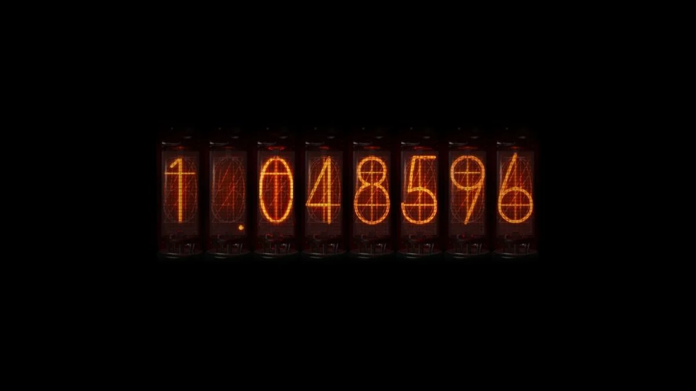

background-image: url(https://ambivalen.files.wordpress.com/2011/09/sg3.png)

```{r setup, include=FALSE}
options(htmltools.dir.version = FALSE)
```

???

Image credit: (https://ambivalen.wordpress.com/2011/09/18/steinsgate-rintarou-okabe/)

---

# Step 1

### Gather all the lab members:

```{r}
labmem_001 <- "Okabe Rintaro"
labmem_002 <- "Shiina Mayuri"
labmem_003 <- "Hashida Itaru"
labmem_004 <- "Makise Kurisu"
labmem_005 <- "Kiryu Moeka"
labmem_006 <- "Urushibara Ruka"
labmem_007 <- "Faris NyanNyan"
labmem_008 <- "Amane Suzuha"

labmem_vec <- c(labmem_001, labmem_002, labmem_003, labmem_004, labmem_005, labmem_006, labmem_007, labmem_008)
print(labmem_vec)
```


---

# Step 2

#### Leap through world lines and reach the Steins;Gate world line! 
```{r}
sg_world_line <- 1.048596

print(sg_world_line)
```


```{r, out.width='60%', fig.align='center'}

```


---


# Step 3


## You all know it (like do I really have to say?)

## Everybody shout together:

# El Psy Congroo!!!!
